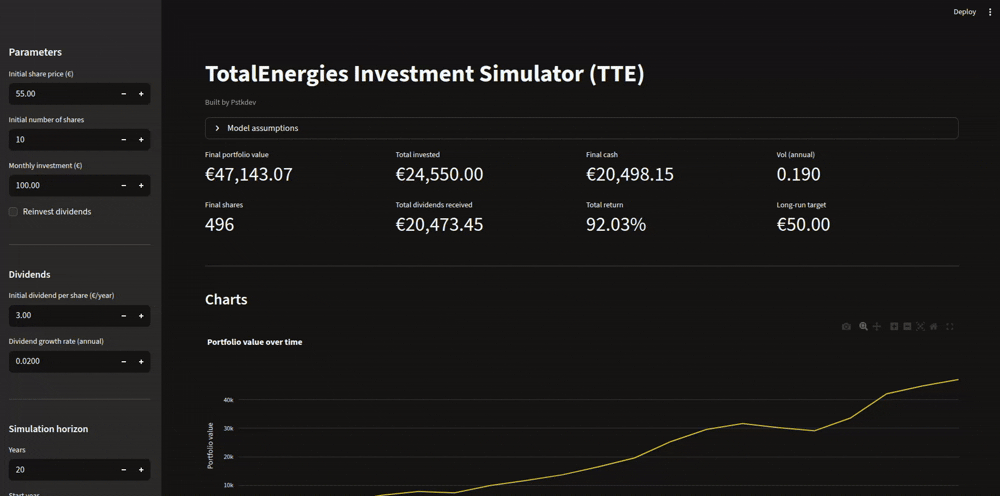

# TotalEnergies Investment Simulator (TTE)

A **stochastic** long-term simulator for an investment in **TotalEnergies (TTE)** shares over a chosen time horizon.  

This project includes a **Streamlit** interface: users can adjust parameters (dividend growth, dividend reinvestment, monthly contributions, mean reversion, volatility) and see results and charts update instantly.

The price path is simulated using a simple **mean-reverting model + annual volatility shocks**.

Dividends are modelled as **quarterly** payments, in line with TotalEnergies’ quarterly dividend policy.

<p align="center">
  
</p>


---

## Disclaimer

**This simulator is designed for educational and illustrative purposes only.**

**It does not constitute investment advice and does not guarantee any future performance.**  
**All projections are based on simplified assumptions that may differ significantly from real-world outcomes.**

**Investing involves risk, including the potential loss of capital.**

---

## Table of Contents

- [Why this project?](#why-this-project)
- [Features](#features)
- [Model overview](#model-overview)
- [Limitations](#limitations)
- [Installation](#installation)
- [How to use](#how-to-use)

---

## Why this project?

This project was initially built as a **personal investment tool**.

I wanted:
- A free and fully customizable simulator.
- A transparent model I fully understand.
- A tool reflecting a long-term dividend strategy.
- An interactive UI to test scenarios quickly.
- To learn how to model volatility in Python.
- To learn how to use yfinance for basic historical-data calibration.

---

## Features

### Stochastic price simulation (mean reversion + volatility)
- The share price is simulated once per year using:
  - a **long-run price target** (user-defined)
  - a **mean reversion speed** (user-defined)
  - an **annualised volatility** parameter (user-defined or estimated from historical data)

**Notes**
- I experimented with estimating the long-run target and mean-reversion speed from historical prices, but the estimates were highly sensitive to the chosen time window. These inputs are left to the user.
- I chose a mean-reverting price model because TotalEnergies has historically behaved like a cyclical value stock: prices often fluctuate around a long-term anchor rather than compounding smoothly like a growth stock. This is a modelling assumption, not a guarantee.

### Dividends (quarterly) + optional reinvestment
- Dividend per share grows annually: `dividend_growth_rate`
- Dividends are paid **quarterly** (`annual DPS / 4`)
- If `reinvest_dividends` is enabled:
  - dividends are reinvested at each quarterly payment date
- If disabled:
  - dividends remain as cash

### Monthly investing (no fractional shares)
- Monthly contributions: `monthly_investment`
- Contributions are grouped by quarter (`monthly * 3`) and invested at quarterly prices.
- Shares are purchased as **whole integers only**.
- Leftover cash is tracked and carried forward.

### Streamlit UI
- Sidebar controls for parameters
- Summary metrics (final value, shares, cash, dividends, total invested, total return)
- Interactive charts (Plotly)
- Full results table (can be downloaded as CSV)

---

## Model overview

### Price model (yearly)
Each year, the end-of-year price is simulated as:

- Mean reversion toward `long_run_price`
- Plus a random shock proportional to `vol_annual` (Gaussian noise)

Quarterly prices are approximated by **linear interpolation** between the start and end price of the year (used only to decide quarterly purchase/reinvestment prices).

### Cash flow and buys
Within each year (4 quarters):
- Add contributions for 3 months
- Buy whole shares (remainder stays as cash)
- Receive quarterly dividends
- Optionally reinvest dividends (whole shares)

---

## Limitations

This project is designed for **scenario exploration**, not exact forecasting. Real-world results may differ for many reasons:

- No taxes, no broker fees, no spreads.
- The price model is simplified (mean reversion + Gaussian shocks).
- Quarterly prices are approximated using interpolation (not real market paths).
- Dividend timing is simplified to quarterly equal payments.
- The user must input a **long-run target price** and mean reversion assumptions.
- Historical volatility estimation (if used) is based on simplified monthly data processing.

---

## Installation

### Option A — Local (Python venv)

1. Clone the repository and go into the project directory:
    ```bash
    git clone https://github.com/Pstkdev/TotalEnergies-Investment-Simulator.git
    cd TotalEnergies-Investment-Simulator/
    ```

2. Create a virtual environment:
    ```bash
    python3 -m venv .venv
    source .venv/bin/activate
    ```

3. Install dependencies:
    ```bash
    pip install -r requirements.txt
    ```

4. Run the app (Streamlit) from the project root:
    ```bash
    streamlit run app.py
    ```

Streamlit will display a local URL.

### Option B — Docker Compose

1. Clone the repository and go into the project directory:
    ```bash
    git clone https://github.com/Pstkdev/TotalEnergies-Investment-Simulator.git
    cd TotalEnergies-Investment-Simulator/
    ```

2. Build and run:
    ```bash
    docker compose up --build
    ```
Then open http://localhost:8501 (copy paste in your web browser)

If you get a "permission denied ... docker.sock" error on Linux, add your user to the docker group:
  ```bash
  sudo usermod -aG docker $USER
  newgrp docker
  ```
  
---


## How to use

In the sidebar you can set:

- Initial share price, initial shares
- Monthly investment
- Dividend assumptions:
  - initial dividend per share
  - dividend growth rate
  - reinvest dividends
- Simulation horizon:
  - years
  - start year
- Price model assumptions:
  - long-run price target
  - mean reversion speed
  - annualised volatility (manual or auto-estimated)
  - random seed

The app shows:
- Summary metrics
- Interactive charts
- A detailed results table

---
